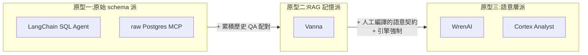

# 第 6 章:對照組 —— 五種「自然語言問資料庫」方案的機制比較

> 深挖優先序:**第 1(2026-07 新增後)**。前五章確立了 WrenAI 是什麼;
> 這章回答選型問題:**跟其他方案比,WrenAI 的語意層/治理投資在什麼場景回本、
> 什麼場景是多餘的?**
>
> 方法論:每個方案都讀了原始碼或官方一手文件(標註檔案路徑),不採信行銷頁。
> 調研基準:2026-07,LangChain community 0.4.2、Vanna(0.x + 2.0 rewrite)、
> LlamaIndex core 0.14.23、Snowflake Cortex Analyst 官方文件、
> Postgres MCP(官方 archived server + MCP Pro)。

---

## 6.0 先建框架:三種原型,不是五個產品

五個方案背後其實只有**三種原型**,trade-off 在原型層面就決定了大半:

- **原始 schema 派**:LLM 直接看資料庫的 DDL/catalog,零建模成本,
  所有語意(join 怎麼接、指標怎麼算)靠 LLM 現場猜。
- **RAG 記憶派**:在原始 schema 之上累積「訓練素材」(DDL + 文件 + 歷史
  NL→SQL 配對),用向量檢索餵給 LLM。語意是**學來的**,不是定義的。
- **語意層派**:人先把語意寫成機器可讀的契約(WrenAI 的 MDL、Snowflake 的
  semantic model),LLM 對著契約寫查詢,引擎負責展開與強制。語意是**編譯的**。

三種原型的根本 trade-off 一句話:**建模成本 vs 語意確定性**。往右走,
前期投入越高、答案越可控;往左走,啟動越快、每個答案都是即興發揮。

**補充說明(為什麼把 MCP 列進來)**:raw MCP server 不是傳統 text2SQL「產品」,
但它是 2026 年企業實際上最常見的形態——「把 DB 接給 Claude/agent 直接查」。
它是**零語意層的 null hypothesis**:所有其他方案的價值,都該拿它當基準線衡量。
而且它和 WrenAI main 架構上是近親(都是 agent + 工具),差別恰好就是 WrenAI
多出來的那層 MDL + policy——對照起來最能看清那層值多少。

---

## 6.1 LangChain SQL Agent(原始 schema 派・工具迴圈)

**機制**(`langchain_community/utilities/sql_database.py`、
`agent_toolkits/sql/`,v0.4.2):

- **schema 理解**:SQLAlchemy 反射出字面 `CREATE TABLE` DDL + 每表 3 列樣本資料
  (`sample_rows_in_table_info=3`,引 Rajkumar et al. 2022 說樣本列提升準確度)。
  不是整包塞——agent 有兩段式工具:`sql_db_list_tables`(只回表名清單)→
  `sql_db_schema`(拉指定表的 DDL)。**LLM 自己決定看哪些表,依據只有表名。**
- **驗證/修正**:兩道,都不是真驗證——(1) `sql_db_query_checker`:用另一次
  LLM 呼叫「double check 這句 SQL 常見錯誤」,純建議,沒有機制強制先跑;
  (2) 執行錯誤以字串回到 agent 觀察值,prompt 教它「rewrite and try again」,
  retry 是 ReAct 迴圈的湧現行為(上限 `max_iterations=15`)。
  **沒有 dry-run、沒有 AST 檢查。**
- **治理**:趨近於零。`include_tables/ignore_tables` 只過濾 **LLM 看得到什麼**,
  不擋執行——LLM 猜中被忽略的表名照樣查得到。「DO NOT make any DML」是 prompt
  懇求。`top_k=10` 的列數限制**只寫在 prompt 裡**,從不強制包 LIMIT。
  官方 docstring 自己把安全責任推給 DB:「Use least-privilege database roles
  (ideally read-only, schema-limited)」。
- **值得注意的官方自白**:0.4.2 的 `create_sql_agent` docstring 明白標注這套
  AgentExecutor 是 legacy,建議新專案改用 LangGraph/deepagents + toolkit 工具。

**vs WrenAI 什麼場景見真章**:
- 表多且命名相似時,「靠表名猜」崩得最快——沒有 embedding 檢索,選錯表就
  燒 iteration。
- 沒有任何地方放業務語意(非 FK 的 join 路徑、指標定義),WrenAI MDL 解的
  正是這題。
- schema 常變動時它反而佔優:DDL 是活反射的,沒有要維護的 manifest。
- **治理對比最殘酷**:WrenAI 有引擎 RLAC/CLAC + policy firewall;LangChain 在
  LLM 輸出和 DB 連線之間**什麼都沒有**。

---

## 6.2 Vanna(RAG 記憶派)

**機制**(`vanna-ai/vanna`;注意 2026 repo 已大改版,舊 API 在 `legacy/`,
新版是 agent 架構):

- **schema 理解**:RAG over 三類「訓練」素材——`add_ddl`(DDL 字串)、
  `add_documentation`(自由文字)、`add_question_sql`(歷史 QA 配對)——
  存進向量庫,每問檢索各 top-10(`chromadb_vector.py`),組進 prompt
  (貪婪塞到 ~14K token 上限,`base.py::get_sql_prompt`)。
  QA 配對以 few-shot 對話輪注入,且 guideline 明示「問過的問題請一字不差
  重複之前的答案」。
- **驗證/修正**:核心 `generate_sql` **沒有** execute-and-retry;
  `is_sql_valid` 只檢查「是不是 SELECT」(sqlparse type check),不是語法驗證。
  Flask UI 有單發的 `/api/v0/fix_sql` 修一次。2.0 改為 agent 迴圈後,
  retry 變成湧現行為(工具回錯誤字串給 LLM,上限 10 輪)。
- **兩個要在企業評估時圈出來的設計**:
  1. **`auto_train=True` 的回饋圈**:`ask()` 只要查詢**有回傳列**就自動把
     QA 配對存進訓練庫——「跑得動」被當成「答對了」。錯誤 SQL 一旦入庫,
     配上「重複之前答案」的 guideline,錯誤會**自我強化**。
  2. **行銷 vs 原始碼的落差(本教材方法論的活教材)**:官網宣傳
     「Enterprise Security / Row-level security」,原始碼裡 RLS 是
     `ToolRegistry.transform_args` 的一個 **NoOp hook**——docstring 寫明
     「The default implementation performs no transformation. Subclasses can
     override」。內建的只有工具級的 group 門禁 + audit log 模組;
     row/column 級控制要**自己 subclass 實作**。對照 WrenAI 的
     `access_control.rs` 是引擎裡真的改寫 logical plan——同樣寫著
     「row-level security」,保證程度差一個量級。
- **資料外洩面**:`generate_summary` 把**整個 df 的 markdown** 送 LLM;
  `allow_llm_to_see_data=True` 時中間查詢結果也進 prompt(預設 False,這點
  給 credit);2.0 的 run_sql 工具送 1000 字元 CSV 預覽給 LLM、全量寫檔。

**vs WrenAI 什麼場景見真章**:
- QA 配對飛輪是 Vanna 最強的資產:用得越久越準,而且是 WrenAI legacy
  historical-question 檢索與 main `wren memory recall` 的同源思路——
  差別在 WrenAI 的 `memory store` 靠**人工確認**入庫,Vanna 的 `auto_train`
  靠「有回傳列」入庫。
- schema 變動是 Vanna 的痛點:沒有同步機制,過期的 DDL embedding 和失效的
  訓練 SQL 會一直留在庫裡污染檢索,要手動 `remove_training_data`。
  WrenAI 的 MDL 是單一事實來源,schema 變動 = 改一份 manifest,過期 SQL
  在 strict mode 下 plan 期就大聲失敗(預設非 strict 時會靜默 fallback、
  到引擎展開或 DB 端才報錯——又一個「要開 strict」的理由,第 1 章 §1.5b)。
- 指標一致性:Vanna 的 join/指標邏輯每問重新推導,兩種問法可能得到兩種
  revenue 定義;WrenAI 的 calculated field/metrics 是 deterministic 展開。

---

## 6.3 LlamaIndex NLSQL(原始 schema 派・帶選配檢索)

**機制**(`llama-index-core` 0.14.23,`sql_retriever.py`、`sql_wrapper.py`、
`table_node_mapping.py`):

- **schema 理解**:兩檔引擎——
  - `NLSQLTableQueryEngine`:**每問把所有(或指定)表的 schema 全塞進 prompt**;
  - `SQLTableRetrieverQueryEngine`:把每張表的 `SQLTableSchema`(表名+欄位
    +人寫的 `context_str` 描述)embed 進 ObjectIndex,每問檢索 top-k 相似表,
    再活拉該表最新 schema 進 prompt。
  表描述是選配的語意 enrichment,但只到表級,沒有關係/指標建模。
  (細節:文件宣傳的 `context_str_prefix` 參數在現行原始碼裡**存了但從沒用**,
  `sql_retriever.py:231`——讀碼 vs 讀文件的又一例。)
- **驗證/修正**:**都沒有**。原始碼直接註解 `# assume that it's a valid SQL
  query` 後執行。預設 `handle_sql_errors=True` 的行為要看清楚:出錯時把
  錯誤字串包成 TextNode 送進 response synthesis——**使用者拿到的是 LLM
  把錯誤訊息改寫成的漂亮回答,不是修正後的查詢**(error masking,
  不是 error correction)。generic 的 `RetryQueryEngine` 存在但預設不接。
- **結果處理(直接回答你第 2 章的問題,而且比 WrenAI 更糟)**:
  `run_sql` 是 `cursor.fetchall()` **無列數上限**,只有每格 300 字元截斷;
  預設 `synthesize_response=True` 把 `str(全部rows)` 交給 response synthesizer,
  大結果集會被**分塊跑多輪 LLM 呼叫**(COMPACT mode)而不是截斷——
  百萬列 SELECT = 全量進記憶體 + 全量進 LLM(分批)。
- **治理**:無。`include_tables` 同樣只管可見性不管執行;官方緩解措施是
  docstring 建議「use restricted roles, read-only databases, sandboxing」。

**vs WrenAI 什麼場景見真章**:
- 表多:NLSQL 檔 prompt 爆炸,得手動換 TableRetriever 檔;檢索粒度只有
  「表」,沒有欄位級剪裁。
- schema 常變:活內省是優勢(schema 改了自動反映),但 ObjectIndex 裡的
  表描述 embedding 會過期要手動重建——「活 schema、死索引」的混合狀態。
- 多輪對話:QueryEngine 是單發設計,無對話狀態。
- 它最大的教學價值是當**「有檢索、無語意層、無驗證」**的中間樣本:
  證明光解決「挑表」不解決「join/指標語意」和「驗證」,錯誤只是換了位置。

---

## 6.4 Snowflake Cortex Analyst(語意層派・治理反向鏡像)

**機制**(官方文件,proprietary 無原始碼):

- **schema 理解**:LLM 對著**人工編寫的 semantic model**(YAML 或 2026 主推的
  Semantic Views)工作——logical tables、dimensions、facts、metrics、
  relationships、同義詞、描述。官方直說:「Generic AI solutions often struggle
  with text-to-SQL conversions when given only a database schema」——
  與 WrenAI 的 MDL 論述完全同調。另有 **Verified Query Repository(VQR)**:
  人工驗證過的 NL→SQL 配對存在 semantic model 裡當 few-shot——
  跟 `wren memory store` / Vanna QA 配對是同一招,但要求配對引用邏輯名
  而非實體名。
- **驗證/修正**:無內建 dry-run 或 retry;REST API 回 SQL,**執行是呼叫端
  的事**。準確度靠事前的 VQR + evaluations 功能管理,不靠事後修正。
- **治理(和 WrenAI 的根本分歧點,本章最重要的一段)**:
  Cortex Analyst 生成的 SQL **用終端使用者本人的 Snowflake role 執行**,
  倉庫既有的 RBAC、row access policy、column masking **自動全部生效**。
  官方:「fully integrates with Snowflake's role-based access control (RBAC)
  policies」。

把第 3 章 §3.2 的表格擴成三方對照,這是全書關於資料隔離最重要的一張表:

| | WrenAI(應用層注入) | Cortex Analyst(倉庫層繼承) | LangChain/MCP/LlamaIndex |
|---|---|---|---|
| 過濾發生在哪 | WrenAI 產 SQL 時注入 WHERE | DB 引擎以**使用者本人 role** 執行時強制 | 無 |
| 繞過工具直連 DB | **失效** | **仍有效**(policy 在 DB 端) | 本來就沒有 |
| 身份傳遞 | 呼叫端要自己把 session property 接對(第 3 章的斷鏈) | 使用者本來就是用自己的帳號,**沒有「接身份」問題** | 無 |
| policy 與 DB 權限漂移 | 可能(MDL 規則 vs DB grant 是兩套) | 不可能(只有一套) | — |
| 跨資料源 | ✅ 任何 connector 都有 RLAC | ❌ Snowflake-only | — |

**Cortex 的治理在它的地盤上無懈可擊,代價是鎖死單一倉庫;WrenAI 用「自己實作」
換來跨源通用,代價是第 3 章講的整條身份鏈都要自己顧。** 這不是誰優誰劣,
是「治理放哪一層」的架構選擇——但如果你的資料本來就全在 Snowflake,
Cortex 的治理故事明顯省事得多。

- **維護成本上兩者是同病相憐**:semantic model/VQR 和 MDL 一樣要人工維護,
  rename/refactor 會讓 verified queries 靜默失效——語意層原型的共同稅。

---

## 6.5 raw Postgres MCP(零層基準線)

**機制**(官方 archived postgres server + Postgres MCP Pro):

- **schema 理解**:純 catalog 內省。官方 server 把每表 schema 當 MCP resource
  暴露(`postgres://<host>/<table>/schema`);MCP Pro 給
  `list_schemas/list_objects/get_object_details` 工具讓 agent 按需查。
  **所有業務語意由 LLM 現場腦補。**
- **驗證/修正**:無。agent 跑 SQL、看錯誤字串、自己重試(無上限的湧現迴圈)。
  MCP Pro 的 restricted mode 有一個真檢查:pglast 解析 AST,擋 COMMIT/ROLLBACK
  防逃逸 READ ONLY transaction + 執行時間上限。
- **治理**:官方 server = READ ONLY transaction,僅此而已;MCP Pro 加資源限制。
  **沒有 row/column 級控制、沒有遮蔽**——連線的 DB user 能 SELECT 什麼,
  agent 就能讀什麼、就會進 LLM context。唯一防線是 DBA 給的最小權限 role。
- **架構上它就是「拆掉 MDL 和 policy.py 的 WrenAI main」**:同樣是
  agent + 工具 + DB,中間那層的差異就是 WrenAI 的全部價值主張。
  WrenAI `policy.py` 擋的那些威脅(file reader、SSRF、`dblink` 橫向移動,
  issue #2409)在 raw MCP 場景全部敞開,只剩 DB 權限硬扛。

**什麼時候 raw MCP 是對的答案**:內部工程師自查、資料本身不敏感、
schema 小且命名自明。此時語意層是純開銷。**什麼時候它崩**:寬 schema
(join/指標全靠猜,準確度塌方)、敏感資料(無隔離、無 DLP)、
需要可重複的答案(每次都是即興)。

---

## 6.6 總比較表

你要的三軸 + 我補的兩軸(治理與結果處理,因為前五章證明這兩軸才是企業場景的
分水嶺):

| | **WrenAI main** | **LangChain SQL Agent** | **Vanna** | **LlamaIndex NLSQL** | **Cortex Analyst** | **raw Postgres MCP** |
|---|---|---|---|---|---|---|
| **schema 理解方式** | MDL 編譯的語意層;≤30K chars 全量、超過 embedding 檢索(`store.py`) | 活反射 DDL+3 列樣本;agent 憑表名挑表 | 向量檢索訓練庫(DDL/文件/QA 對,各 top-10) | 全塞 or 表級 embedding 檢索(兩檔引擎) | 人工 semantic model(YAML/Semantic Views)+ VQR | 純 catalog 內省,LLM 現場猜 |
| **SQL 生成後驗證** | `dry-plan`/`dry-run` 原語 + strict-mode firewall(預設關);修正迴圈由 agent 主導 | LLM self-check 工具(建議性)+ 錯誤回饋湧現 retry(≤15 輪) | 核心無 retry;`is_sql_valid` 只查是否 SELECT;2.0 湧現 retry(≤10 輪) | **無**;錯誤被 LLM 改寫成回答(error masking) | 無(執行歸呼叫端);靠事前 VQR/evaluations | 無;湧現 retry;Pro 有 AST 擋逃逸 |
| **需要額外語意層定義?** | **要**(MDL YAML,可用 agent 端的 `generate-mdl` skill 起步) | 不用 | 不用(但要「訓練」) | 選配(表描述) | **要**(semantic model) | 不用 |
| **存取控制/隔離** | 引擎內建 RLAC/CLAC(身份鏈要自己接,第 3 章) | 無(靠 DB role) | 工具級 group 門禁;RLS 是 NoOp hook 待自製 | 無(靠 DB role) | **倉庫 RBAC/masking 以使用者本人 role 全繼承** | 無(靠 DB role + READ ONLY) |
| **結果→LLM 的保護** | SDK 工具:limit=100/cap 1000/16KB 顯式截斷;CLI/API 無 | 無;`str(全部rows)` 進 context,`top_k` 只是 prompt 建議 | summary 送全量 df;`allow_llm_to_see_data` 預設 False | **無上限 fetchall + 分塊全送 LLM** | 執行歸呼叫端(不經 LLM 除非你送) | agent 拿到什麼就進 context |
| **準確度飛輪** | `memory store/recall`(人工確認入庫) | 無 | QA 訓練庫(`auto_train` 有污染風險) | 無 | VQR(人工驗證入庫) | 無 |
| **schema 變動成本** | 改 MDL + `context build` + `memory index`;過期 SQL 在 strict mode 下 plan 期大聲失敗 | 零(活反射) | 手動清理過期訓練資料(易污染) | schema 活、表描述索引死 | 手動維護 semantic model;VQR 靜默失效 | 零(活內省) |

---

## 6.7 場景判定:什麼時候語意層的投資回本

收斂成教材式的決策指引(判準延續第 5 章:敏感資料場景的可信度優先):

1. **表多(>50)且命名不自明** → 原始 schema 派准確度塌方(憑表名猜表、
   憑欄名猜 join)。RAG 派靠檢索續命但檢索錯 = 自信地錯。語意層派在這裡回本:
   MDL/semantic model 把「哪張表是 canonical、join 走哪條」變成契約。
2. **指標一致性有合規/對帳意義**(revenue、MAU 這種數字不能兩種問法兩個答案)
   → 只有語意層派能保證:calculated field/metrics 是 deterministic 展開,
   不是 LLM 每次重新發明。
3. **schema 週更、語意月更** → 語意層的維護稅最重的場景。若語意本身也常變,
   考慮 RAG 派(接受準確度波動)或原始 schema 派(接受每答即興)。
4. **多租戶/敏感資料** → 先問「資料在不在單一倉庫」:在 Snowflake →
   Cortex 的繼承式治理最省心;跨源 → WrenAI 是唯一有引擎級 RLAC/CLAC 的
   開源選項,但第 3 章的身份鏈要自己搭。其餘三派在這個場景**不及格**,
   只能靠 DB 端 RLS 硬扛(而它們對 DB 的建議恰恰是共用 read-only role——
   與 per-user RLS 天然矛盾)。
5. **內部工程師自助查詢、資料不敏感** → raw MCP/LangChain 就夠,
   語意層是過度工程。誠實地說,這可能是市面上大多數 demo 的真實場景,
   也是「text2SQL 很簡單」錯覺的來源。

**一句話總結**:五個方案沒有優劣排序,只有「你願意把語意寫下來嗎、
你的資料敏感嗎」兩個問題的四象限。WrenAI 押的是「願意寫 + 敏感」的象限,
而且是該象限裡唯一的開源跨源選項——前五章驗證的結論(語意層可信、
執行層要補)在對照組的映襯下更清楚:它的競品不是做得更好的同類,
而是根本沒做這層的其他原型。

---

## 6.8 本章證據清單

| 方案 | 主要證據位置 |
|---|---|
| LangChain | `libs/community/langchain_community/utilities/sql_database.py`(get_table_info、sample_rows)、`agent_toolkits/sql/`(四工具與 prompt)、0.4.2 `create_sql_agent` docstring(legacy 警告) |
| Vanna | `legacy/base/base.py`(get_sql_prompt:586、generate_sql:93、is_sql_valid:238、auto_train)、`chromadb_vector.py`(top-10 檢索)、2.0 `core/registry.py:113-142`(RLS NoOp hook)、`tools/run_sql.py` |
| LlamaIndex | `sql_retriever.py`(:276 表選擇、:324 "assume valid"、:334 error masking、:231 死參數)、`sql_wrapper.py`(:249 run_sql 無上限 fetchall、:265 300 字元截斷)、`table_node_mapping.py` |
| Cortex Analyst | Snowflake 官方文件(semantic model/Semantic Views、VQR、RBAC 繼承、CORTEX_USER role) |
| Postgres MCP | 官方 archived server README(READ ONLY、resource schema)、Postgres MCP Pro(pglast restricted mode) |
| WrenAI(本表引用) | 前五章已標註,不重複 |

---

**上一章** → [05 企業採用總評](05-enterprise-verdict.md)　|　**回目錄** → [README](../README.md)
