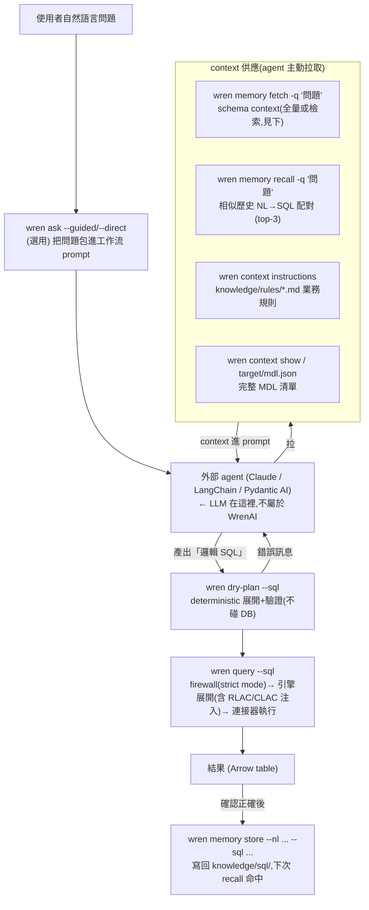

# 第 1 章:text2SQL 的真實分工邊界

> **Snapshot note**：本章原始研究以 `a8a7519`（2026-07-09）為基準。
> 核心分工、30K branch、query-scoped manifest 與 current agent-native path 已在
> `9a0f032` 以
> [fundamentals/04-query-lifecycle](../fundamentals/04-query-lifecycle.md)、
> [fundamentals/05-context-memory](../fundamentals/05-context-memory.md) 與實驗重驗。
> 文內舊行號只作歷史定位，引用前請改用 symbol 與 `UPSTREAM_STATE.md`。
>
> 深挖優先序:**第 3**(2026-07 修訂後上調)。這章的價值是**正本清源**:用原始碼證明
> LLM 到底做了什麼、沒做什麼,以及 WrenAI 靠什麼(而不是靠 LLM 更聰明)來降低
> SQL 生成錯誤。
>
> **2026-07-09 修訂**:原版把 main 的 context 組裝當成「不存在,要看 legacy」——
> 這只對了一半。main 其實有一整套自己的 context 供應鏈(`wren memory` / `wren ask` /
> skills / SDK 工具),而且設計哲學和 legacy 的 RAG 不同。本次修訂補上 §1.2,
> legacy 降為對照組。

破除的表層說法:「WrenAI 用 RAG 把 schema 塞給 LLM,叫它生 SQL」。
真相要拆成三個問題:(1) LLM 拿到的 context 是什麼、怎麼拿到?(2) 引擎和 LLM
各做哪一半?(3) 常見錯誤靠什麼壓下來?

> 術語註記:官方文件自 2026-07-06(commit `e25c808`)起把整套東西改稱
> **context layer**(不再自稱 semantic layer)。本教材沿用「語意層」指 MDL 本體,
> 「context layer」指 MDL + knowledge/ + memory 的整包。

---

## 1.1 MDL:LLM 看到的不是原始 schema,是編譯過的語意契約

**補充說明(為什麼加這段)**:MDL 是全書所有機制的地基,第一次出現必須講透。

MDL(Modeling Definition Language)是一份可版控的 YAML(拆在 `models/`、`views/`、
`relationships.yml`),由 `wren context build` 編譯成 `target/mdl.json`。
官方定位:「Raw schemas describe storage. MDL describes meaning.」
(`docs/core/concepts/what_is_mdl.md:7`)。它定義:

- **Models**:邏輯資料集(對應實體表或一段 SQL)
- **Columns**:欄位、改名、型別、主鍵,以及 **calculated fields**(計算欄位,
  例如 `avg(reviews.Score)` 這種跨表聚合,公式定義一次、處處引用)
- **Relationships**:模型間的 join 路徑(你的分析團隊信任的那條)
- **Views / Cubes / Metrics**:可重用的查詢介面與指標
- **RLAC / CLAC**:row/column-level 存取控制(見第 3 章)

型別定義在 `core/wren-core-base/src/mdl/manifest.rs`。

MDL 之外,context layer 還有兩個純文字成員(這是 2026 版新的專案佈局):

- **`knowledge/rules/*.md`**:schema 表達不了的業務規則(「active customer 排除
  service account」「一律過濾 `is_deleted = false`」)。
- **`knowledge/sql/*.md`**:人工確認過的 NL→SQL 配對,當 few-shot 範例用。

⚠️ **先立一個第 4 章會回收的伏筆**:`knowledge/rules` 是**給 LLM 讀的 prompt 素材**
(由 `wren context instructions` 印出,`context_cli.py:777`),引擎在 planning 時
**完全不會**強制它——`load_rules()`(`context.py:726`)沒有任何來自 `engine.py` 的
呼叫。MDL 裡的 RLAC/CLAC 才是引擎強制的。「寫在 rules 裡的治理」和「寫在 MDL 裡的
治理」強度是兩個世界,官方文件把這兩者混在一起講(第 4 章拆穿)。

---

## 1.2 main 的 context 供應鏈:LLM 怎麼拿到這些東西(2026-07 補寫)

main 不含 LLM,但它精心設計了「把 context 餵給外部 agent」的整條供應鏈。
一句自然語言問題的完整路徑:



這條路徑不是我腦補的——它被寫死在三個地方,agent 想照做就會照做:

1. **`wren context init` 產生的 AGENTS.md 模板**(`context.py:20-72`)明文規定
   工作流:`memory fetch → memory recall → 寫 SQL(用 model 名)→ wren --sql 執行
   → memory store`。
2. **`wren ask --guided` 模板**(`ask_templates/guided.md.tmpl`)給弱一點的 LLM
   一字一句的任務流:`context show → memory recall → 寫 SQL → dry-plan 驗證 →
   query 執行`,並約束「use model names, never invent column names」。
   (順手抓到一個上游 bug:guided 模板寫的是 `wren memory recall --nl`,
   但 recall 指令只收 `--query/-q`(`memory/cli.py:400`),`--nl` 是 `store`
   的參數——照著模板做的 agent 會吃 unknown-option 錯誤。「prompt 模板跟
   CLI 版本漂移」正是 skills 機制想解決的問題,結果 bundled 模板自己先漂了。)
3. **skills 機制**:`skills/wren/SKILL.md` 是個 discovery stub,實際工作流指南
   藏在 CLI 套件內(`core/wren/src/wren/skills_content/`),用 `wren skills get usage`
   拉取——版本跟著 `pip install wrenai` 走,沒有 skill 快取漂移問題。

### schema context 的篩選邏輯:30,000 字元的分水嶺

你問過:「20 張表的資料庫,怎麼決定只把 3 張相關的表送進 LLM context?」
main 的答案出乎意料:**小 schema 根本不篩,全量給;大 schema 才切 embedding 檢索。**

`wren memory fetch` 底層的 `MemoryStore.get_context()`(`memory/store.py:211`):

```python
text = describe_schema(manifest)          # 把整個 MDL 編成結構化純文字
if len(text) <= threshold:                # threshold = SCHEMA_DESCRIBE_THRESHOLD
    return {"strategy": "full", "schema": text}    # ← 全量塞
# 超過才走 embedding 檢索
results = self._search_schema(query, limit=limit, ...)   # 預設 top-5
return {"strategy": "search", "results": results}
```

分水嶺定義在 `memory/schema_indexer.py:36`:

```python
# ~30K chars ≈ ~8K tokens.  Below this threshold the full plain-text
# description fits comfortably in a single LLM context window and
# outperforms embedding search because the LLM sees the complete
# schema structure (model→column relationships, join paths, etc.)
# rather than isolated fragments.
# …(中略:chars-vs-tokens 取捨與 CJK 註記,下文白話轉述)
SCHEMA_DESCRIBE_THRESHOLD = 30_000
```

用具體數字讀這段:一張表的純文字描述(model 名 + description + 主鍵 + 每欄位
名稱/型別/註解)大約 300–800 字元。**20 張表 ≈ 6K–16K 字元 < 30K → `strategy="full"`,
20 張全部進 prompt,一張都不篩。** 要到大約 50–100 張表(視註解豐富度)才會跨過
30K,切成 `strategy="search"`:問題向量 vs schema item 向量
(sentence-transformers,本地跑,不需 API key,`memory/embeddings.py`),
取 top-5 相關的 model/column/relationship 片段。

原始碼註解還交代了兩個誠實的設計取捨:
- 閾值用「字元數」不用 token 數,因為算字元免費、精確算 token 要拖 tokenizer 依賴;
- CJK 文字的 chars-to-tokens 比例(~1.5:1)比英文(4:1)差,所以**中文重的 schema
  會更早切到檢索模式**——註解自己說這是「保守(安全)方向」。

**和 legacy 的哲學差異**:legacy 是「永遠檢索」(embedding 挑相關表);main 是
「能全給就全給,不得已才檢索」。main 的立場有官方文件背書:檢索片段會丟失
「model→column 從屬、join 路徑」這種結構資訊,完整 schema 在放得下的前提下
準確度更好(`docs/core/concepts/correctness.md` 也批評「dump 整個 schema」和
「讓模型亂猜」是兩個失敗模式,memory 的做法是兩者的折衷)。

### 歷史查詢記憶:recall 的 few-shot 迴路

`wren memory recall -q "問題" --limit 3`(`memory/cli.py:399`)對
`knowledge/sql/*.md` 裡人工確認過的 NL→SQL 配對做語意搜尋(裝了 `[memory]` extra
用 LanceDB embedding;沒裝就退化成免依賴的 token-overlap grep,`index_backend.py`)。
另外 `wren memory index` 時會從 MDL 自動生成一批 canonical seed 配對
(`seed_queries.py`),讓冷啟動時 recall 不是空的。

這是 main 版的「few-shot 學習迴路」:答對 → `memory store` 寫回 →
下次類似問題 recall 命中 → 準確度隨使用累積。和 Vanna 的 question-SQL 訓練庫
思路同源(第 6 章比較),但 WrenAI 把「存什麼」留給人工確認,不自動回收。

### SDK 路徑:不走 CLI 的 agent 拿什麼

自建 agent 用 `wren-langchain` / `wren-pydantic` 時,context 供應變成工具:
`wren_list_models`(MDL 清單)、`wren_fetch_context`(= memory fetch)、
`wren_recall_queries`(= memory recall),執行是 `wren_dry_plan` + `wren_query`
(`sdk/wren-langchain/src/wren_langchain/_tools.py`、`_tools_memory.py`)。
機制同一套,只是從「agent 跑 CLI」變成「agent 呼叫 tool」。

---

## 1.3 legacy/v1 對照:內建 RAG pipeline 怎麼組 context(仍是好範本)

legacy 是「WrenAI 自己就是那個 agent」的年代,值得看的是它怎麼把 MDL 編成
LLM-friendly 的 context:

MDL 被編成帶「語意註解」的 DDL 餵給 LLM
(`wren-ai-service/src/pipelines/generation/utils/sql.py`):

```sql
CREATE TABLE orders (
  -- {"description":"A column that represents the timestamp when the order was approved.","alias":"_timestamp"}
  ...
  -- This column is a Calculated Field
  -- column expression: avg(reviews.Score)
)
```

重點:
- 每個欄位帶 `description` 與 `alias`,LLM 因此知道 `status=4` 是「退款」這種
  業務語意——原始 schema 給不了。
- **Calculated Field 的展開式直接寫在註解裡**,LLM 只要在 SELECT 用這個欄位名,
  不必自己拼 join + aggregate。把「容易錯的部分」從 LLM 手上拿走。

檢索端(`retrieval/db_schema_retrieval.py`):embedding 檢索與問題相關的表、
組 DDL、tokenizer 算 token、超量就剪。**永遠走檢索**,沒有 main 的
「小 schema 全量」策略。

main 把這套的精神(語意註解、calculated field 預先固定)搬進了
`describe_schema()` 的純文字格式與 MDL 本身,把「檢索 or 全量」的決策變成
30K 閾值,把「生成」整個讓渡給外部 agent。

---

## 1.4 引擎 vs LLM 的分工邊界:哪些是 deterministic、哪些交給 LLM

這是本章最實質的部分。分工如下:

| 工作 | 誰做 | 是否 deterministic | 證據 |
|---|---|---|---|
| 自然語言 → 邏輯 SQL | **LLM / 外部 agent** | ❌ 機率性 | main 不含 LLM;legacy `generation/sql_generation.py` |
| 挑哪些 schema 進 context | **memory(30K 閾值)** | ✅(全量)/ 半(檢索) | `store.py:216`、`schema_indexer.py:36` |
| relationship → 實際 JOIN | **Rust 引擎** | ✅ | `wren-core` MDL 展開 |
| calculated column → aggregate 子查詢 | **Rust 引擎** | ✅ | `plan.rs` lineage / calculation plan |
| 邏輯 SQL → 目標方言 SQL | **Rust 引擎 + sqlglot** | ✅ | `engine.py::dry_plan` 註解的轉換流程 |
| 只允許 MDL 內的表/欄位 | **引擎 + policy** | ✅ | `policy.py`、`extract_by` |
| row/column 存取控制 | **Rust 引擎** | ✅ | `access_control.rs`(第 3 章) |

### `dry_plan` 的展開流程(deterministic 的那一半)

`engine.py::dry_plan` 的 docstring(`engine.py:87-99`)逐字說明轉換管線:

```
User SQL (target dialect, e.g. Postgres)
  → sqlglot parse (target dialect)
  → qualify_tables + normalize_identifiers + qualify_columns
  → identify referenced models and columns
  → per-model: wren-core transform_sql → Wren dialect SQL
  → per-model: sqlglot parse (Wren dialect) → inject as CTE
  → sqlglot generate (target dialect)
  → output SQL with model CTEs in target dialect
```

翻白話:LLM 產的是「對著 MDL 模型的邏輯 SQL」(例如
`SELECT total_revenue FROM orders`,其中 `total_revenue` 是計算欄位)。引擎接手後:

1. 用 `wren-core`(Rust/DataFusion)把每個模型 `transform_sql` 展開成含 JOIN、
   aggregate、計算式的實體 SQL;
2. 把展開結果當 CTE 注入(`mdl/cte_rewriter.py::CTERewriter`);
3. 再用 sqlglot 生成目標資料庫方言(Postgres/BigQuery/…)。

**所以「JOIN 怎麼接、計算欄位怎麼算、方言差異」全是引擎 deterministic 處理的,
不經 LLM。** LLM 只碰最上層的邏輯查詢意圖。

---

## 1.5 對常見 LLM SQL 錯誤的防禦:靠架構,不是靠 LLM 更聰明

拆四種典型錯誤,對照 WrenAI 的防禦:

### (a) JOIN 錯誤(接錯表、接錯鍵、漏 join)
- **防禦**:relationship 在 MDL 預先定義,計算欄位的 join 由引擎展開。LLM 若只用
  MDL 暴露的欄位,根本沒機會手寫錯 join。
- **殘留風險**:若 LLM 產的邏輯 SQL 直接跨模型手寫 join(而非用預定義關係),
  仍可能錯。MDL 降低機率,不是消滅。

### (b) 欄位誤用(用了不存在或不該用的欄位)
- **防禦(強)**:strict-mode `policy.py` + `extract_by` 只讓 SQL 參照 MDL 內的
  models/views;參照不存在的表會在 planning 階段擲 `WrenError`,**不會送到 DB**。
  ```python
  # engine.py::_plan(行 183-184)
  if self._config.strict_mode or self._config.denied_functions:
      validate_sql_policy(ast, queryable_names, self._config)
  ```
- **注意**:此防禦**預設關閉**(`strict_mode=False`,`config.py:32`,見第 4 章)。
  不開就退化成「LLM 自律」。而且 `engine.py:206`:非 strict 模式下 SQL 解析失敗時
  會**靜默 fallback 到完整 manifest**,不報錯。

### (c) 聚合邏輯錯誤(平均的平均、fan-out 重複計數)
- **防禦**:指標與計算欄位在 MDL 用 metrics/cubes/calculated field 預先定義好正確
  公式,LLM 引用名稱即可,不必自己拼 aggregate。引擎的 lineage
  (`required_fields_map`)確保計算欄位依賴的欄位被正確帶入。

### (d) 語法/方言錯誤 → 修正迴圈
- **main**:`wren dry-plan` / `wren dry-run` 提供「不回傳資料就驗證」的原語;
  guided 模板明文要求 agent 在執行前先 dry-plan。dry-plan 失敗時的錯誤訊息
  (哪個欄位不存在、可用欄位有哪些)回到 agent,由 agent 自己修正重試——
  修正迴圈存在,但**主導權在 agent**,WrenAI 只提供 deterministic 的驗證器。
- **legacy** 的對照:`generation/sql_correction.py` 是內建的修正管線——dry-run
  拿到 DB 錯誤後,把「錯誤訊息 + schema + SQL」餵回 LLM 要求修正。

**小結**:WrenAI 降錯的主力是**把高風險決策 deterministic 化 + 用 dry-plan 驗證**,
而不是「祈禱 LLM 更強」。但最強的那道表/欄位白名單(strict mode)預設是關的。

---

## 1.6 負責這段邏輯的模組(標註)

| 功能 | 檔案 |
|---|---|
| MDL 型別定義 | `core/wren-core-base/src/mdl/manifest.rs` |
| MDL 語意展開(邏輯 SQL → 實體 SQL) | `core/wren-core/core/src/logical_plan/**` |
| planning 協調 + 方言轉換 | `core/wren/src/wren/engine.py`、`mdl/cte_rewriter.py` |
| **schema context 策略(30K 閾值)** | `core/wren/src/wren/memory/store.py::get_context`、`schema_indexer.py:36` |
| **schema → LLM 純文字描述** | `core/wren/src/wren/memory/schema_indexer.py::describe_schema` |
| **NL→SQL 記憶(store/recall/seed)** | `core/wren/src/wren/memory/{cli,store,seed_queries}.py` |
| **agent 工作流模板** | `core/wren/src/wren/ask.py` + `ask_templates/`、`context.py`(AGENTS.md 模板) |
| **skills 遞送** | `skills/wren/SKILL.md`(stub)、`core/wren/src/wren/skills_content/` |
| **SDK context/query 工具** | `sdk/wren-langchain/src/wren_langchain/{_tools,_tools_memory}.py` |
| SQL 白名單/firewall | `core/wren/src/wren/policy.py` |
| (legacy) 檢索:MDL→DDL、embedding | `wren-ai-service/src/pipelines/retrieval/db_schema_retrieval.py` |
| (legacy) 生成 + 自我修正 | `wren-ai-service/src/pipelines/generation/{sql_generation,sql_correction}.py` |

---

## 1.7 動手驗證 🔬

```bash
# 1. 安裝 CLI(含 memory extra)
pip install "wrenai[memory]"

# 2. 看 30K 閾值的兩種策略切換(本章 1.2 的核心主張)
wren memory index                                   # 先建索引
wren memory fetch -q "customer orders" --output json
#   小 schema:預期 {"strategy":"full","schema":"### Model: ..."} — 全量,無檢索
wren memory fetch -q "customer orders" --threshold 100 --output json
#   人為壓低閾值模擬大 schema:預期 {"strategy":"search","results":[top-5 片段]}

# 3. 用 sample dataset 看「邏輯 SQL → 展開後的實體 SQL」
wren dry-plan --sql "SELECT total_revenue FROM orders"
#   觀察:引擎把 total_revenue 展成含 JOIN/aggregate 的 CTE,並轉目標方言(§1.4)

# 4. 驗證欄位白名單(需開 strict_mode)
#    在 ~/.wren/config.json 設 {"strict_mode": true} 後,查 MDL 沒定義的表,
#    應在 planning 階段報 WrenError
wren dry-run --sql "SELECT * FROM some_table_not_in_mdl"

# 5. 看 agent 實際被指示的工作流
wren ask "上季营收前五的客戶?" --guided     # 印出包好的 prompt,不執行
wren skills get usage                        # CLI 內建的 agent 工作流指南
```

---

**上一章** → [00 兩套架構](legacy-v1-architecture.md)　|　**下一章** → [02 大量結果處理](large-result-handling.md)
